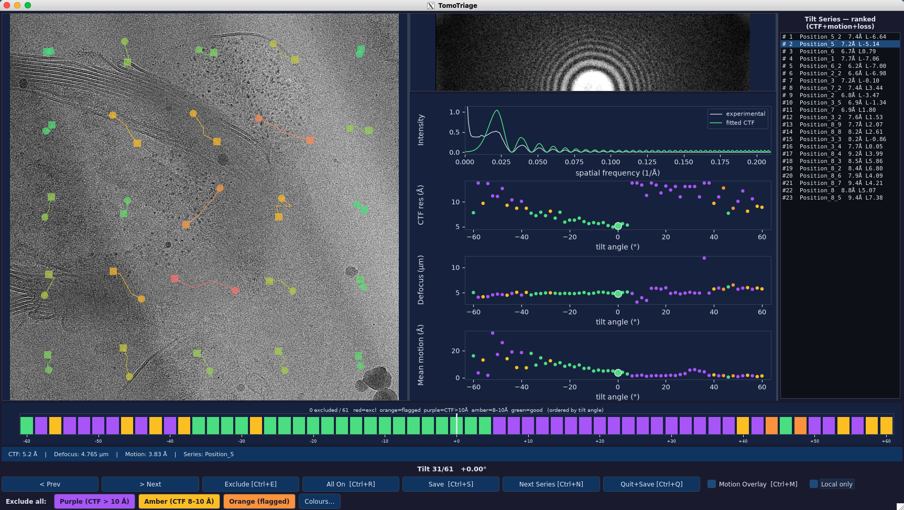

# TomoTriage

An interactive quality control tool for tilt series data processed with [WarpTools](https://github.com/warpem/warp). Inspect tilt images, power spectra, and motion correction results before proceeding to alignment and reconstruction.

> **This tool was developed with assistance from [Claude](https://claude.ai) (Anthropic) as part of a cryoET subtomogram averaging pipeline.**

---

## Features

- **Tilt image with motion overlay** on the left; **power spectrum and diagnostic plots** on the right (CTF fit, CTF resolution, defocus, and motion vs tilt angle)
- **Images from `average/`** — every acquired tilt is shown (loaded from the per-tilt motion-corrected averages), so excluded tilts remain visible and can be re-included later
- **Motion track overlay** drawn spatially on the tilt image — each patch placed at its correct grid position and colour-coded by motion magnitude (green = low, red = high). Toggle on/off with a checkbox or `Ctrl+M`
- **CTF-colour-coded overview bar** — ordered by tilt angle (0° centre, extremes at the edges); click any bar to jump directly to that tilt. Category colours **and the CTF thresholds** are customisable.
- **Exclusion** of bad tilts writes to `<UseTilt>` in the tilt-series XML (mapped by tilt angle); the `.tomostar` is never modified, and previous exclusions are restored automatically on next load
- **Bulk exclude-by-colour** — exclude all tilts of a category (purple / amber / orange) in one click, on the current dataset or across all loaded datasets
- **Whole-dataset rejection** — "Exclude ALL frames" marks every tilt in a dataset excluded; "Exclude dataset" moves its XML out to `excluded_datasets/` so downstream WarpTools / miss-alignment steps skip it entirely
- **Scrollable tilt series list** — switch between datasets with a click
- **Automatic dataset ranking** — the tilt-series list is ranked by quality (best at the top, #1 = best) using CTF resolution, motion, and, once alignment has run, the miss-alignment loss. Auto-detects whether alignment has been done and ranks accordingly. Ranking runs in the background so the window opens fast even for hundreds of tomograms.
- **Per-tilt metadata** — CTF fit (Å), defocus (µm), and motion (Å) from WarpTools per-frame XML

---

## Installation

### 1. Clone the repository

```bash
git clone https://github.com/jjenkins01/TomoTriage.git
cd TomoTriage
```

### 2. Create the conda environment

Using the provided `environment.yml`:

```bash
conda env create -f environment.yml
conda activate tomotriage
```

Or manually:

```bash
conda create -n tomotriage \
    python=3.11 pyqt numpy mrcfile matplotlib \
    -c conda-forge -y
conda activate tomotriage
```

### 3. Install the `tomotriage` command (recommended)

Installing the package with `pip` registers a `tomotriage` command so you can launch it from anywhere without typing `python` or the full path:

```bash
pip install -e .
```

The `-e` (editable) flag means `git pull` updates take effect immediately without reinstalling. After this you can run:

```bash
tomotriage --tomostar_dir $warp_fs --frame_dir $warp_fs --xml_dir $warp_ts
```

> If you prefer not to install, you can always run the script directly with `python tomotriage.py --tomostar_dir $warp_fs ...`

### 4. Verify the installation

```bash
python -c "from PyQt5.QtWidgets import QApplication; print('PyQt5 OK')"
tomotriage --help
```

---

## Updating

If you already have a previous version installed and want the latest release from GitHub:

### If you installed with `pip install -e .` (editable mode)

This is the simplest case — the editable install points directly at your local clone, so a `git pull` is all that is needed. The `tomotriage` command picks up the new code automatically.

```bash
cd TomoTriage     # your local clone
git pull origin main
```

> `git` does not require the conda environment to be active. You only need the environment active when you actually run `tomotriage`.

### If you installed with a regular `pip install .` (non-editable)

A plain install copies the code into the environment, so after pulling you must reinstall for the changes to take effect:

```bash
cd TomoTriage
git pull origin main
conda activate tomotriage
pip install . --upgrade
```

### If you only downloaded the script (no pip install)

Replace your local `tomotriage.py` with the latest version from the repository, or re-clone:

```bash
cd TomoTriage
git pull origin main
```

then run it directly with `python tomotriage.py ...`.

### If the dependencies changed

The conda environment only needs to be recreated if `environment.yml` has changed (rare). If a new release notes a dependency change, update with:

```bash
conda env update -f environment.yml --prune
```

### Checking your version

```bash
cd TomoTriage
git log --oneline -1        # shows the latest commit you have
git tag --points-at HEAD    # shows the release tag, if any
```

If a new feature you expect isn't showing up, check **which file is actually being imported** — this catches the common case of editing one copy of the repo while running another (or a stale copy under `~/.local/`):

```bash
python -c "import tomotriage; print(tomotriage.__file__)"
```

That path is the file that runs. If it isn't the repo you just updated, copy the new `tomotriage.py` over *that* path (or reinstall). With an editable install (`pip install -e .`) the running file *is* your repo copy, so a `git pull` is enough.

Compare against the [releases page](https://github.com/jjenkins01/TomoTriage/releases) to see whether a newer version is available.

---

## Requirements

- Linux with X11 display (local or SSH with `-X` / `-Y` forwarding)
- Conda / Mamba (Miniforge recommended)
- WarpTools preprocessing already run — the visualiser reads its output
  files directly

---

## Directory layout

The visualiser expects standard WarpTools output structure, here's an example with a single tomogram called tomogram01:

```
warp_frameseries                                 Frame-series processing dir
├── tomogram01.tomostar                          Tilt series metadata (can be in a separate directory if you like)
├── tomogram01_001_*_Fractions.xml               Per-frame CTF / motion XML
├── powerspectrum/
│   └── tomogram01_001_*_Fractions.mrc           Power spectrum per tilt
└── average/
    ├── tomogram01_001_*_Fractions.mrc           Per-tilt motion-corrected average (DISPLAYED by the visualiser)
    └── tomogram01_001_*_Fractions_motion.json   Motion tracks per tilt

warp_tiltseries                                  Tilt-series processing dir
├── warp_tiltseries.settings                     WarpTools settings file
└── tomogram01.xml                               Tilt-series XML (<UseTilt> — exclusions saved here)
```

> The visualiser displays the per-tilt images from `average/` and saves exclusions to the tilt-series `.xml`. It does **not** read the `.st` stack in `tiltstack/` — that stack is produced later by `ts_stack`, which reads the `<UseTilt>` exclusions you set here.

Setting shell variables beforehand can help to speed up commands but not essential:

```bash
warp_fs=/path/to/warp_frameseries
warp_tomostar=/path/to/tomostar_dir
warp_ts=/path/to/warp_tiltseries
```

---

## Usage

### Batch mode — all tilt series in a directory

```bash
conda activate tomotriage

tomotriage \
    --tomostar_dir $warp_fs \
    --frame_dir    $warp_fs \
    --xml_dir      $warp_ts
```

### Batch mode — after alignment (ranking includes the alignment loss)

Point `--loss_dir` at miss-alignment's `*_alignment_loss.json` files to rank the datasets on CTF, motion, **and** alignment loss:

```bash
tomotriage \
    --tomostar_dir $warp_fs \
    --frame_dir    $warp_fs \
    --xml_dir      $warp_ts \
    --loss_dir     $warp_ts/raw_data_.../   # wherever the *_alignment_loss.json live
```

### Single tilt series

```bash
tomotriage \
    --tomostar  $warp_fs/tomogram01.tomostar \
    --frame_dir $warp_fs \
    --xml       $warp_ts/tomogram01.xml
```

### All arguments

| Argument | Description |
|---|---|
| `--tomostar_dir DIR` | Directory containing `.tomostar` files (batch mode) — typically `$warp_fs` |
| `--tomostar STAR` | A single `.tomostar` file (single-series mode) |
| `--frame_dir DIR` | **Required.** Frame-series dir (`$warp_fs`) containing `average/` (per-tilt images + `*_motion.json`), `powerspectrum/`, and per-frame XMLs. Images are loaded from `average/`. |
| `--xml_dir DIR` | Directory containing tilt-series XML files (batch mode) — typically `$warp_ts`. Defaults to the tomostar's own directory. |
| `--xml XML` | Tilt-series XML (single-series mode) — auto-detected next to the tomostar if omitted |
| `--loss_dir DIR` | Directory of miss-alignment `*_alignment_loss.json` files. When present, the alignment loss is included in the dataset ranking (post-alignment mode). |
| `--sigma FLOAT` | Sigma for auto-flagging intensity outliers (default: 3.0) |
| `--contrast_lo INT` | Lower percentile for image contrast (default: 2) |
| `--contrast_hi INT` | Upper percentile for image contrast (default: 98) |
| `--logo IMG` | Path to a splash-screen logo image (defaults to `logo.png` next to the script) |
| `--no_splash` | Skip the startup splash screen |
| `--io_workers N` | Number of parallel workers for reading ranking metadata at startup (default: 16). Higher can be faster on high-latency network storage; `1` = serial. |
| `--ctf_amber A` | CTF resolution (Å) good/amber boundary — tilts worse than this become amber (default: 8.0). Also adjustable live in the Categories… dialog. |
| `--ctf_purple A` | CTF resolution (Å) amber/purple boundary — tilts worse than this become purple (default: 10.0). Must exceed `--ctf_amber`. |

---

## Interface



### Tilt image panel

Displays the motion-corrected average for the current tilt. When a tilt is excluded a red overlay appears, showing the TomoTriage tilt-series mark in the centre with a label beneath it: **"Frame excluded"** for a single tilt, or **"Series excluded"** when every tilt in the series is excluded.

**Motion overlay** — when enabled, draws each motion-correction patch trajectory at its spatial position on the image. A faint grid shows the patch boundaries. Tracks are colour-coded by arc-length:

| Colour | Motion |
|---|---|
| Green | Low |
| Yellow | Medium |
| Red / orange | High |

Toggle with the **Motion Overlay** checkbox or `Ctrl+M`.

One additional control refines the motion display:

- **Local only** — subtracts the global mean trajectory (averaged across all patches) from each patch, leaving only the local, non-global component of the motion. This matches the "only local motion" option in the Warp GUI and is useful for spotting localised beam-induced movement.

### Right-hand panel: power spectrum and diagnostic plots

The right-hand side stacks the power spectrum on top of four equal-height diagnostic plots, all updating as you navigate between tilts.

**Power spectrum** (top) — the CTF power spectrum from `powerspectrum/`, shown with square-root scaling and cropped to the 128-row signal band so the rings are clearly visible.

**1. CTF fit** — the experimental 1D power spectrum and the fitted CTF² for the current tilt, plotted as **Intensity** vs spatial frequency, following Warp's fitting convention. The experimental curve is the stored 1D power spectrum with the fitted background subtracted; the fitted curve is the analytical CTF²
multiplied by the fitted scale envelope. Both share the same envelope and decay together across the full frequency range, just as in the Warp GUI (low high-frequency amplitude is normal and expected). The fitted line is coloured to match the tilt's category (green / amber / purple, or red if the tilt is excluded), so you can judge fit quality at a glance.

**2–4. CTF resolution (Å), Defocus (µm), and Mean motion (Å) vs tilt angle** — scatter plots across the whole series, with each point coloured by its tilt category. The current tilt is drawn enlarged so you can locate it. These let you spot trends across the tilt range (e.g. resolution degrading at high tilt, or motion outliers).

### Overview bar

One coloured bar per tilt, **ordered by tilt angle** — the most negative tilt on the left, 0° in the centre, and the most positive on the right. For a dose-symmetric series (e.g. −60° → +60°) this means the bar mirrors the physical tilt geometry rather than the acquisition order. Sparse angle labels are shown along the axis. **Click any bar to jump directly to that tilt.**

Colour coding (priority order):

| Colour | Meaning |
|---|---|
| Red | Excluded |
| Orange | Auto-flagged (intensity outlier, ±3σ from mean) |
| Purple | CTF fit > 10 Å |
| Amber | CTF fit 8–10 Å |
| Green | CTF fit ≤ 8 Å |

These colours are **customisable** — click the **Colours…** button to recolour any category with a colour picker. Changes apply live to both the overview bar and the bulk-exclude buttons. Colour choices are session-only and reset to the defaults above on the next launch.

### Bulk exclude-by-colour

A row of coloured buttons below the main controls excludes every tilt of a given category in a single click, which is faster than stepping through them one at a time:

- **Purple (CTF > X Å)** — exclude all poorly-fitting tilts
- **Amber (CTF X–Y Å)** — exclude all moderate-fit tilts
- **Orange (flagged)** — exclude all auto-flagged intensity outliers

The purple/amber CTF boundaries default to 10 Å and 8 Å but are adjustable (see `--ctf_amber` / `--ctf_purple` and the Categories… dialog); the button labels update to match. These act on the current tilt series and respect existing exclusions (already excluded tilts are left as-is). The result is saved to `<UseTilt>` like any other exclusion.

A second row — **"Exclude in ALL datasets"** — applies the same category exclusion to *every* loaded dataset at once. Because this is a sweeping action, it asks for confirmation first, and then offers to save the exclusions to all affected tilt-series XMLs in one step.

### Rejecting a whole dataset

Two buttons in the bulk row handle whole-dataset rejection, and they do different things:

- **Exclude ALL frames** — marks *every* tilt in the current dataset as excluded (`UseTilt=False`), after a confirmation prompt. The XML **stays** in the processing folder; nothing is written until you Save, and tilts can be re-included afterwards.
- **Exclude dataset** (red outline) — takes the dataset **out of processing entirely** by moving its tilt-series XML into an `excluded_datasets/` subdirectory (a timestamped backup is written to `xml_original_backups/` first), then removing it from the list. Because WarpTools and miss-alignment glob `*.xml` in the processing directory and not its subdirectories, the dataset is then skipped by every downstream step. The `.tomostar` and raw data are left untouched — move the XML back out of `excluded_datasets/` to restore it.

Prefer **Exclude dataset** for a tomogram you want to drop from the run: a fully-excluded-but-still-present XML (what "Exclude ALL frames" leaves behind) prepares to an empty stack, which can crash `miss-alignment`. Moving it out avoids that.

### Tilt series list (ranked)

Lists all tilt series, **ranked by quality with the best at the top** (rank #1 = best). Click a name to switch to it; scroll with the mouse wheel. Each row shows the rank, the series name, its CTF resolution, and — after alignment — the alignment loss.

**How the ranking works.** Each series is scored on up to three metrics, all "lower is better": **CTF resolution**, **motion**, and the **miss-alignment loss**. Each metric is ranked separately across all series, and the ranks are averaged into an overall rank. This avoids any single metric with a large numeric range dominating.

**Stage auto-detection.** TomoTriage detects whether alignment has been run:

- **Pre-alignment** (no `--loss_dir`, or no loss files found): ranks on CTF + motion, read from the per-frame XMLs. The list header reads "ranked (CTF+motion)".
- **Post-alignment** (`--loss_dir` given and loss files present): includes the alignment loss as a third component and reads the updated CTF/motion from the tilt-series XMLs. The header reads "ranked (CTF+motion+loss)".

The alignment loss is miss-alignment's own precision-weighted model score (lower = better); it is comparable *within* a single processing run, which is exactly the within-dataset comparison the ranking makes. A series missing all metrics sorts to the bottom.

**Ranking happens in the background.** So the window opens quickly even with many tomograms, the list first appears in file order with the header "Tilt Series — ranking…", and re-sorts into ranked order a moment later once the metadata has been read (in parallel — see `--io_workers`). Whatever series you have selected stays selected when the list re-sorts. On large, network-stored datasets this takes the window from potentially a minute or two down to a second or two.

---

## Keyboard shortcuts

| Key | Action |
|---|---|
| `←` / `→` | Previous / next tilt |
| `Ctrl+E` | Toggle exclude on current tilt |
| `Ctrl+M` | Toggle motion overlay |
| `Ctrl+S` | Save exclusions for current series |
| `Ctrl+N` | Move to next series |
| `Ctrl+Q` | Save and quit |
| `Ctrl+R` | Reset — mark all tilts as included |

> **Why Ctrl+E and not just E?** The tilt series list widget consumes single-letter keypresses for its built-in search, so bare `E` never reaches the window's key handler. `Ctrl+<letter>` combinations bypass this.

### Mouse navigation

| Action | Effect |
|---|---|
| **Scroll wheel over the tilt image** | Step through tilts (follows the angle-sorted order — scroll up for more positive tilts, down for more negative) |
| **Click a bar in the overview** | Jump directly to that tilt |
| **Click a name in the tilt series list** | Switch to that series |

---

## What gets saved

When you press **Save** or **Quit+Save**, exclusions are written to the tilt-series XML for the current series:

**Tilt-series XML `<UseTilt>`** — set to `False` for each excluded tilt and `True` for included tilts. This is WarpTools' native exclusion mechanism: `ts_stack`, `ts_ctf`, and `ts_reconstruct` all read `<UseTilt>` and skip the tilts marked `False`. The XML is written in WarpTools' exact format (first value on the opening-tag line, last value on the closing-tag line) so it parses correctly.

> **Note:** the visualiser does **not** modify the `.tomostar` file. Earlier versions removed excluded rows from the tomostar, but this shortened it relative to the full-length `<UseTilt>` list and broke `ts_stack`. Keeping the tomostar intact and recording exclusions only in `<UseTilt>` is the robust approach and round-trips correctly across sessions.

A timestamped backup of the original XML is saved before each write. Backups go into an `xml_original_backups/` subdirectory (created automatically when the tool starts) alongside the tilt-series XML, so they don't clutter the XML directory:

```
warp_tiltseries/
├── tomogram01.xml
└── xml_original_backups/
    └── tomogram01.xml.backup_20260618_154500
```

**Previous exclusions are restored automatically** — the `<UseTilt>` field is read from the XML every time a series is loaded, so reopening a dataset shows your earlier exclusions on the overview bar.

**Excluding a whole dataset** ("Exclude dataset") is different: it does not write `<UseTilt>`, it *moves* the tilt-series XML into an `excluded_datasets/` subdirectory (after writing the same kind of timestamped backup into `xml_original_backups/`). That takes the dataset out of the `*.xml` glob that WarpTools and miss-alignment use, so it is skipped downstream. To restore it, move the XML back out of `excluded_datasets/`.

---

## Acknowledgements

This tool was written by **Joshua Jenkins** with assistance from **[Claude](https://claude.ai)** (Anthropic) as part of a cryoET subtomogram averaging pipeline integrating WarpTools, MissAlignment, RELION 5, and MTools.

---

## Licence

MIT Licence — see `LICENSE` for details.
